# Football Safety

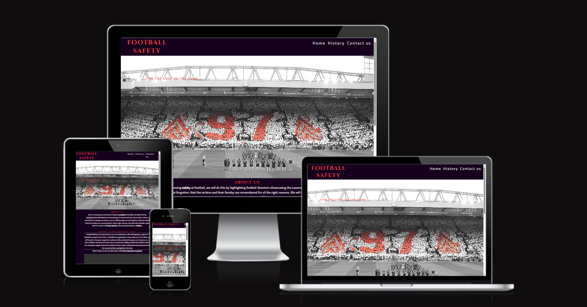

## Project Introduction:

Football Safety is an online website designed to inform football fans of football disasters, showing the effects these have had on the people, how we cannot let the victims be forgotten. This website aims to improve safety at football by providing insight to football fans around the world this will be done by using videos, text and a timeline on our history page.

The inspiration behind this project came from researching about football disasters, how this effected the area whether it was the Bradford fire or the Hillsborough disaster each event impacted the the region and changed football forever.

# CONTENTS

- User Stories

  - Client aims
  - Returning visitor aims

- Design

  - Color Scheme
  - Wireframes
  - Key features
  - Imagery
  - Accessibilty decisions

  - Technologies used
    - Languages used
    - Frameworks & Tools

- Testing

  - W3C HTML validator
  - W3C CSS validator
  - Solved bugs and fixes
    - Known bugs
  - User stories testing
  - Lighthouse testing
    - Home page testing
    - History page testing
    - Gallery page testing
    - Contact us Page testing
  - Full testing

- Credits
  - Images used
    - Media
  - Code used
  - Content
  - Acknowledgments

## User Stories

[Live Site URL:](https://mattthughes.github.io/FootballSafety/)

## User Stories

### Client Goals

- To view this website on many different design sizes
- To understand aim of the website
- To be able to submit a contact form highlighting any new stories they may have or to be kept up to date with new changes
- To find out why football safety is important and why it needs to be improved.

### First Time user goals:

- To understand the importance football safety has the sport
- Be able to view and understand website without any difficulties
- Be able to sign up for and recieve further information by completing a contact us form

### Frequent visitor goals:

- Be able to find information quickly by using timeline
- To add additonal information if required to further improve football safety
- Research different events to gain a greater understanding.

## Design:

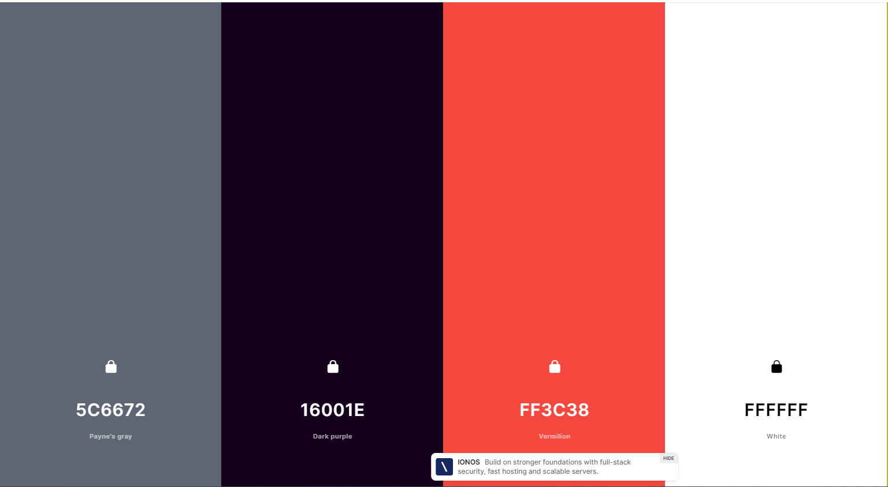
This is the color palatte I decided on all the colours flow together and create an interesting and somber design.

## Wirefames

### Mobile

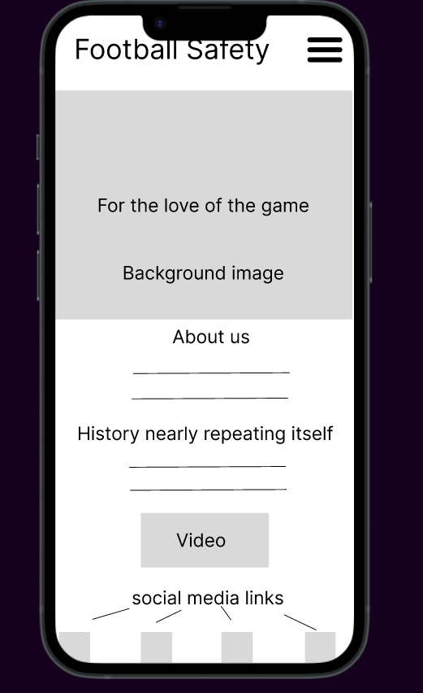

This is the mobile design for the home page everything is highlighted showcasing how the project will look on a mobile device.

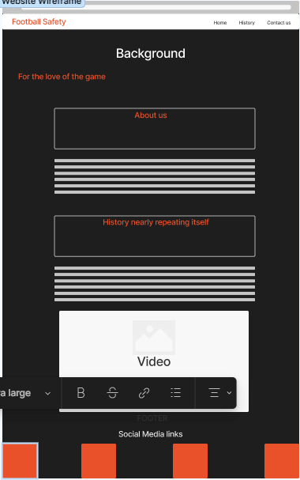

This is how the project will look on a desktop device as shown on the mobile version everything is highlighted how the project is structured on a desktop device.

## Key Features:

### Favicon

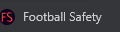

- A favicon generated by using favicon.io
- This was set up in the head section and is visible on most browsers
- This design was very simplistic I liked how the text fit with the colours the background colour was the body background colour and the font colour was the font colour for all headings.

### Navigation Bar

- This feature is highighting the other pages on the website, with the Home, History and contact us page this is shown on the navigation bar with it collapsing on mobile devices and stretching on larger devices, on the mobile format there is a box shadow as well showing the other pages on the website.(See below for the mobile and desktop view)

#### Mobile view

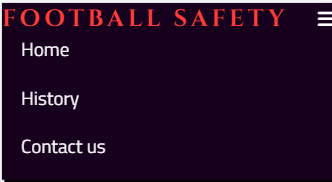

#### Desktop view

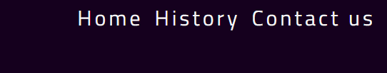

### About us

- Informs users of the purpose of the company and the website, highlights why the website is useful to users and why football safety is important and needs to continue to evolve (See below for the mobile and desktop view)

#### Mobile view

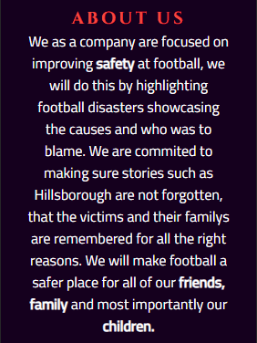

#### Desktop View

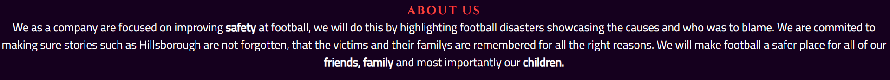

### Videos

- This part showcases a video of the history nearly repeating itself section which further adds engagement to the website the user is able to control whether they want the video to play or not, there is also a text link directing the user to youtube in a new tab incase the browser doesnt have access to HTML5. (See below for the mobile and desktop view)

#### Mobile View

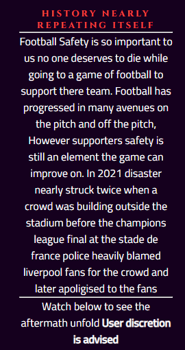
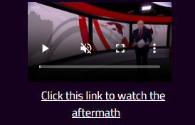

#### Desktop View

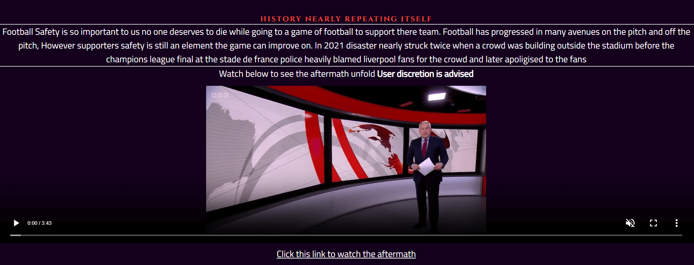

### History timeline

- The history timeline shows the causes and impact the Hillsborough disaster had on the city before, during and after the disaster this timeline also has transition animations that flow as the user scrolls down the page. (See below for the mobile and desktop view)

#### Mobile View

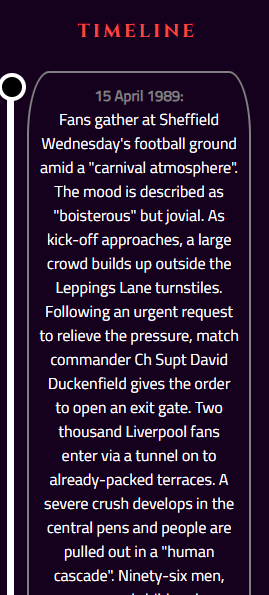
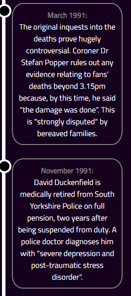

#### Desktop view

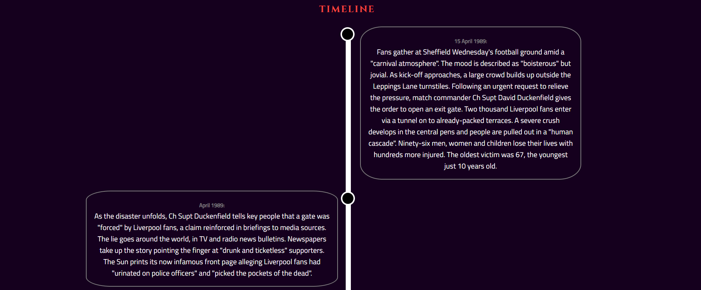

### Contact form

- The contact form will allow users to opt in for further marketing with a checkbox, radio buttons showing where they found the site, the site will allow users to fill in there information such as first name, surname and email address which will all be required. This form will allow users to opt in to provide there own stories and information or any ideas for improving football safety. (See below for the mobile and desktop view)

#### Mobile View

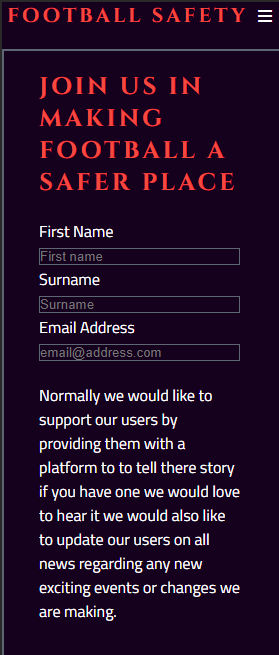
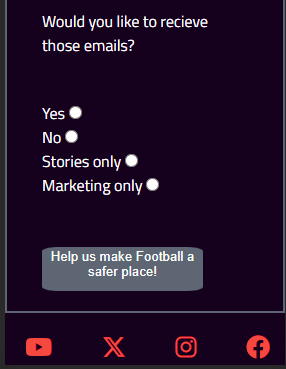

#### Desktop view 

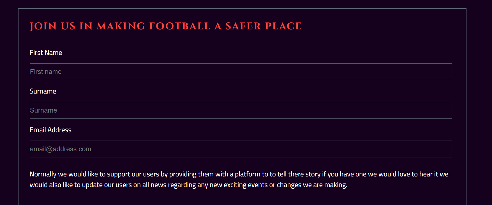
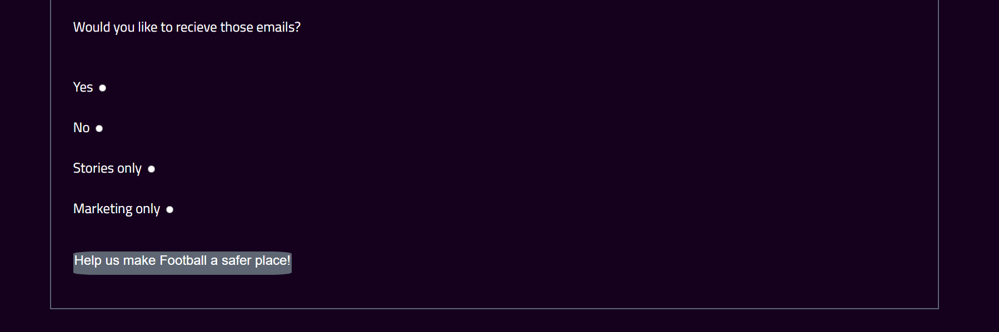

### Social Media icons

- These social media icons will allow users to gain access to our instagram, twitter, facebook, youtube pages allowing users to contact us and be kept up to date with all news regarding football safety. (See below for the mobile and desktop view)

#### Social Media Mobile

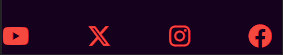

#### Social Media Desktop

### Thank you page 

* This page will showcase to the user the form has been completed with another option for the user to press go back to go to the home page

#### Mobile view

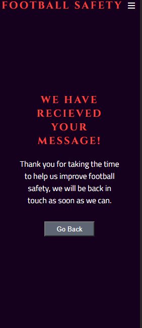

#### Desktop view 

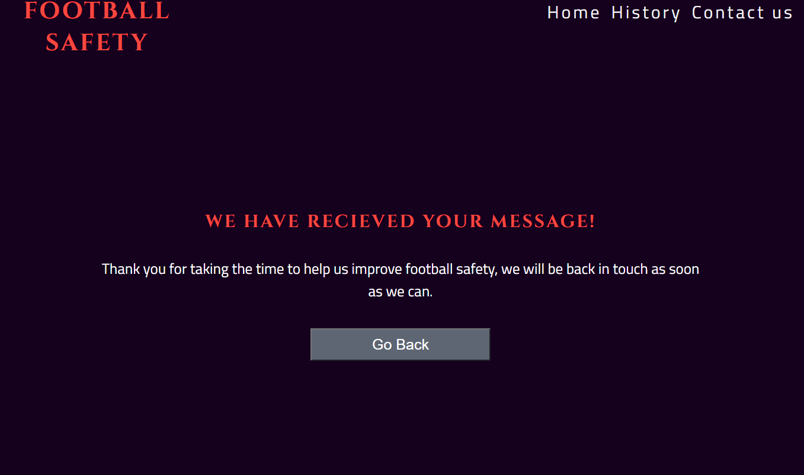

### error 404 page

* This page will be used instead of the usual github page this will keep the same design of the websites other pages with the social icons and navigation bar and will simply state this page doesnt exist there will also be an option to go back to the home page just like the thank you page.

#### Mobile view

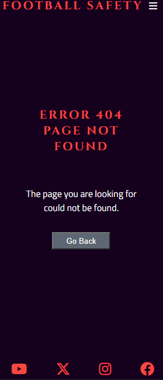

#### Desktop view

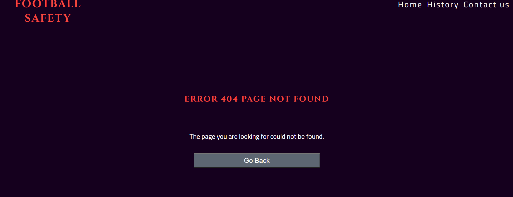

## Accesibility

- Accesiblity was a major focus for the project, making sure colours didnt clash and fit well together.
- I used Coolors, Wave.webaim and the colour grid to find which colors wouked together and which ones did not.
- I also added alt image text for visually impaired users incase the image itself did not load they would still be able to understand what image was meant to be there not ruining the overall flow of the website.
- The video element allows completley control from the user, the video does not autoplay and is muted to start with the user can control this.
- The video also has a link below stating there is a link incase the video is not working this link will open in a new tab not taking the user away from the website.

## Technology

### Languages

- HTML
- CSS

### Frameworks & Tools

- [Git Hub](https://github.com/)
- [Git](https://git-scm.com/)
- [Font awesome](https://fontawesome.com/)
- [Google fonts](https://fonts.google.com/)
- [Code Anywhere](https://codeanywhere.com/solutions/collaborate)
- [Favicon](https://favicon.io/favicon-generator/)
- [Chrome Dev tools](https://developer.chrome.com/docs/devtools/)
- [Tiny PNG](https://tinypng.com/)
- [W3C HTML Validatior](https://validator.w3.org/)
- [W3C CSS Validator](https://jigsaw.w3.org/css-validator/)
- [Wave accessibility evaluation tools](https://wave.webaim.org/)
- [Youtube](https://www.youtube.com/)
- [Twitter](https://twitter.com/home?lang=en)
- [Instagram](https://www.instagram.com/)
- [Facebook](https://en-gb.facebook.com/)
- [Coolors](https://coolors.co/)
- [Contrast Grid](https://contrast-grid.eightshapes.com/?version=1.1.0&background-colors=&foreground-colors=%2315FD38%0D%0A%23045a9c%0D%0A%23786655%0D%0A%23ffffff%0D%0A%23000000&es-color-form__tile-size=compact&es-color-form__show-contrast=aaa&es-color-form__show-contrast=aa&es-color-form__show-contrast=aa18&es-color-form__show-contrast=dnp)
- [Am I Responsive](https://ui.dev/amiresponsive)
- [FLighthouse](https://developer.chrome.com/docs/lighthouse/overview/)

# Testing

### Solved Bugs

- Had an issue where the navigation bar wasnt being centered on desktop devices I changed the padding left value to 6px to fix this issue.
- Fixed a bug where the about us and football safety section were not stacking appropriately on tablet screen sizes.
- Fixed a bug where the contact page was not displaying webpage elements correctly such as footer titles all being in the wrong pace, to fix this I adjusted the html to improve the formating
- Fixed a bug where the timeline wasnt stacking correctly adjusted the height of the timeline dimensions to fit the issue
- Another Issue occured where the timeline content was not showing correctly deleted the height property in the timeline class to fix the issue and increased the padding top value to seperate the containers correctly.
- Fixed formatting issue for timeline ran into an issue where the timeline wasnt adjusting because of the screen size, to fix this I changed the formatting for the mobile device using flex box to make it easier to style the timeline for larger screen sizes.
- Fixed formatting for timeline on laptops and larger devices to fix this I changed the properties of the timeline container, for the circles and for the vertical timeline bar.
- Fixed the video pathway issue by adding in a dot before the forward slash to correctly show the video element on git hub
- Fixed an issue where the hover element was showing twice and was much bigger than the social media icon to fix this I changed the width and height to fit the content.
- Fixed an issue where the nav bar wasnt displaying correctly the contact us part of the nav bar was going onto the next line to fix this I changed the padding left value to 0
- Fixed a CSS error that stated top could not be just 100 added the unit to 0 to fix this issue.
- Fixed an issue with contact page where the sign up form radio buttons were not even to fix this I added different divs for the radio buttons to fix the spacing between the elements 
- Fixed error message for form changed the method from POST to GET to fix this. 
- Fixed issue regarding hover effect the effect would be visible after clicking on mobile changing to a media query to only show up when hovered on laptops and desktops 
- Fixed an error with 404 page the git hub page was continuing to be shown to fix this I renamed the file to a 404.html and this fixed the issue 
- Fixed styling errors regarding 404 page social icons weren't sticking to the bottom of the page increased margin and padding value to fix this.
- Fixed timeline error the timeline on tablets mobiles and desktop devices was working but when checking the responsiveness of the website the circles on the timeline were not staying consistent, The issue for this was the large padding left values with different media querys in order to fix this I adjusted these values and aligned the timeline containers to the center to make sure they were consistent and responsive to fix the circles I increased the left property to 97.5% and this fixed how the circles were aligned on the timeline for larger devices such as tablets and larger desktops. I also changed the width for both left and right containers for tablets to 50% and to 100% for the desktop devices

### Lighthouse testing 

#### After Optimisation

*This showcases each page, after optimisation showing the home, history and contact page for  desktop versions.

#### Home

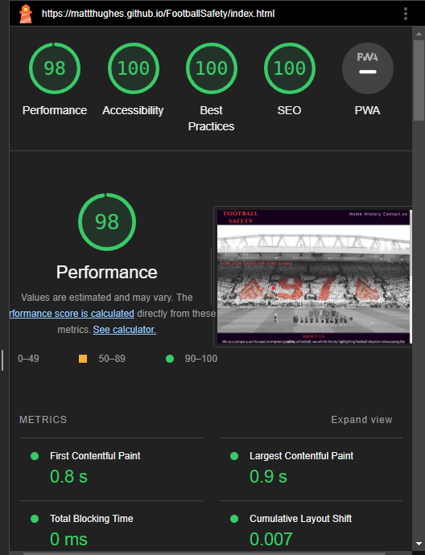

#### History 

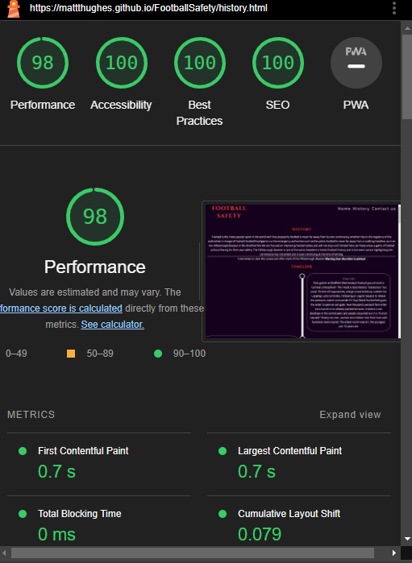

#### Contact-Page 

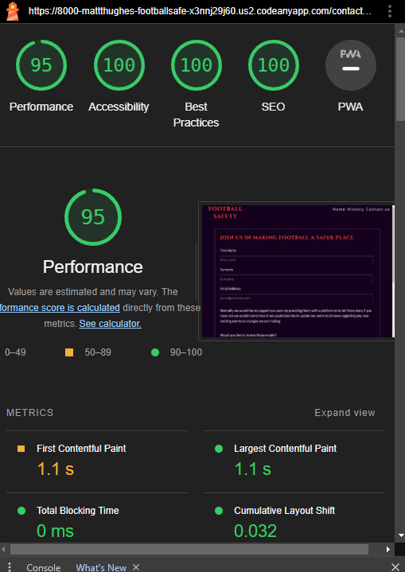

#### Thank you page

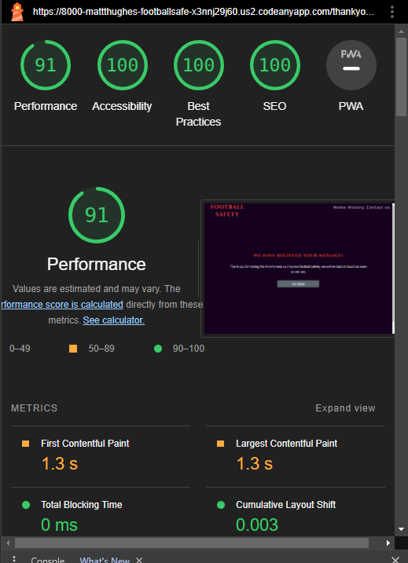

