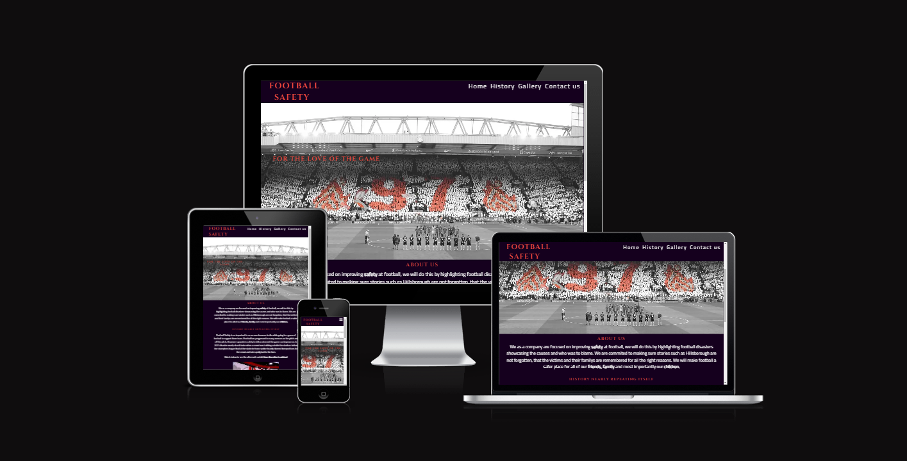

# Football Safety

## Project Introduction:

Football Safety is an online website designed to inform football fans of football disasters, showing the effects these have had on the people, how we cannot let the victims be forgotten. This website aims to improve safety at football by providing insight to football fans around the world, this will be done by using videos, text, images and a timeline on our history page, while also allowing users to submit there own experience by filling in our contact us form.

The inspiration behind this project came from researching about football disasters, how this effected the area whether it was the Bradford fire or the Hillsborough disaster, each event impacted the region and changed football forever.

## CONTENTS

- User Stories

  - Client aims
  - Returning visitor aims

- Design

  - Color Scheme
  - Typography
  - Wireframes
  - Key features
  - Imagery
  - Accessibilty decisions

- Technologies used

  - Languages used
  - Frameworks & Tools

- Depoloyment

  - Local Deployment

- Credits
  - Images used
    - Media
  - Code used
  - Content
  - Acknowledgments

[Click this link to load deployed site](https://mattthughes.github.io/FootballSafety/)

## User Stories

### Client Goals

- To view this website on many different screen sizes.
- To understand the aim of the website.
- To be able to submit a contact form highlighting any new stories they may have or to be kept up to date with new changes.
- To find out why football safety is important and why it needs to be improved.

### First Time user goals:

- To understand the importance football safety has on the sport.
- Be able to view and understand the website without any difficulties.
- Be able to sign up for and recieve further information by completing a contact us form.

### Frequent visitor goals:

- Be able to find information quickly by using a timeline on the history page.
- To add additonal information if required to further improve football safety.
- Research different events to gain a greater understanding on the importance of football safety.

### Future Implementations

- Follow up with another timeline highlighting the Munich air disaster.
- Showcase user stories that have been sent to us.
- Highlight rules that were enforced after specific disasters such as the no standing rule implemented after the Hillsborough disaster.

## Design:

This is the color palatte I decided on, all the colours flow together and create an interesting and somber design which fits the theme.

## Typography

### Headings

I decided to go with the following style for headings I felt this really fit the proffessional design I was going for and didn't take any attention away from the content

### Body

I decided to go with the following style for all other text on the website, as I liked how professional the style looked and like the headings didn't take any attention away from the rest of the content on the website.

## Wirefames

### Mobile

This is the mobile design for the home page, everything is highlighted showcasing how the project will look on a mobile device.

This is how the project will look on a desktop device, as shown on the mobile version everything is highlighted with how the project is structured on a desktop device.

## Key Features:

### Favicon

- A favicon generated by using favicon.io
- This was set up in the head section and is visible on most browsers.
- This design was very simplistic, I liked how the text fit with the colours on the favicon, for the background color of the favicon this was the body background colour of the website and the font colour for the favicon was the font colour for all headings.

### Navigation Bar

- This feature is highighting the other pages on the website, with the Home, History, Gallery, Contact us page this is shown on the navigation bar with it collapsing on mobile devices and stretching on larger devices, on the mobile format there is a box shadow as well showing the other pages on the website.(See below for the mobile and desktop view)

#### Mobile view

#### Desktop view

### About us

- Informs users of the purpose of the company and the website, highlights why the website is useful to users and why football safety is important and needs to continue to evolve. (See below for the mobile and desktop view)

#### Mobile view

#### Desktop View

### Videos

- This part showcases a video of the history nearly repeating itself section, which further adds engagement to the website, the user is able to control whether they want the video to play or not, there is also a text link directing the user to youtube in a new tab, incase the browser doesnt have access to HTML5. (See below for the mobile and desktop view)

#### Mobile View

#### Desktop View

### History

- This showcases what the history page is about and why it is important to the project, allowing users to view the disatorous events of the hillsborough disaster if they wish, this part will allow users to make an informed decision if they wish to proceed further.

#### Mobile view

#### Desktop view

### History timeline

- The history timeline shows the causes and impact the Hillsborough disaster had on the city before, during and after the disaster, this timeline will be responsive for all screen sizes, allow users to learn about the impact the Hillsborough disaster had on the football world. (See below for the mobile and desktop view)

#### Mobile View

#### Desktop view

### Future updates

- This section will tell users about new key information about football safety, informing users of what to look out for in the future, including potential new events such as information about the Munich air disaster.

#### Mobile view

#### Desktop view

### Gallery

- This section will showcase everything we are trying to avoid, showing the aftermath of these disasters, showing events from Hillsborough and the Bradford city fire and along with the crowd trouble during the champions league final which is referenced on the home page, this page will be informative and allow users to understand the impact these events have had on the football world. (See below for the mobile and desktop view)

#### Mobile view

#### Desktop view

### Contact form

- The contact form will allow users to opt in for further marketing with radio buttons asking the user if they would like to opt in or opt out of marketing, the site will allow users to fill in there information such as first name, surname and email address which will all be required. This form will allow users to opt in to provide there own stories and information or any ideas for improving football safety. (See below for the mobile and desktop view)

#### Mobile View

#### Desktop view

### Social Media icons

- These social media icons will allow users to gain access to our Instagram, Twitter, Facebook,and Youtube pages allowing users to contact us and be kept up to date with all news regarding football safety. (See below for the mobile and desktop view)

#### Social Media Mobile

#### Social Media Desktop

### Thank you page

- This page will showcase to the user the form has been completed, with another option for the user to press go back to go to the home page.

#### Mobile view

#### Desktop view

### error 404 page

- This page will be used instead of the usual github page, this will keep the same design of the websites other pages this will also include the navigation bar and social media icons, this page will simply state this page doesn't exist, there will also be an option to go back to the home page just like the thank you page.

#### Mobile view

#### Desktop view

## Accesibility

- Accesiblity was a major focus for the project, making sure colours didn't clash and fit well together.
- I used Coolors, Wave.webaim and the colour grid to find which colors wouked together and which ones did not.
- I also added alt image text for visually impaired users, incase the image itself did not load they would still be able to understand what image was meant to be there not ruining the overall flow of the website.
- The video element allows the user to completely control the video such as sound, pressing play and adjusting the screen size if they wish.
- The video also has a link below stating there is a link incase the video is not working, this link will open in a new tab not taking the user away from the website.

## Technology

### Languages

- HTML
- CSS

### Frameworks & Tools

- [Git Hub](https://github.com/)
- [Git](https://git-scm.com/)
- [Font awesome](https://fontawesome.com/)
- [Google fonts](https://fonts.google.com/)
- [Code Anywhere](https://codeanywhere.com/solutions/collaborate)
- [Favicon](https://favicon.io/favicon-generator/)
- [Chrome Dev tools](https://developer.chrome.com/docs/devtools/)
- [Tiny PNG](https://tinypng.com/)
- [W3C HTML Validatior](https://validator.w3.org/)
- [W3C CSS Validator](https://jigsaw.w3.org/css-validator/)
- [Wave accessibility evaluation tools](https://wave.webaim.org/)
- [Youtube](https://www.youtube.com/)
- [Twitter](https://twitter.com/home?lang=en)
- [Instagram](https://www.instagram.com/)
- [Facebook](https://en-gb.facebook.com/)
- [Coolors](https://coolors.co/)
- [Contrast Grid](https://contrast-grid.eightshapes.com/?version=1.1.0&background-colors=&foreground-colors=%2315FD38%0D%0A%23045a9c%0D%0A%23786655%0D%0A%23ffffff%0D%0A%23000000&es-color-form__tile-size=compact&es-color-form__show-contrast=aaa&es-color-form__show-contrast=aa&es-color-form__show-contrast=aa18&es-color-form__show-contrast=dnp)
- [Am I Responsive](https://ui.dev/amiresponsive)
- [FLighthouse](https://developer.chrome.com/docs/lighthouse/overview/)

## Deployment

### How to deploy

The site is deployed using GitHub Pages - [Football Safety](https://github.com/mattthughes/FootballSafety)

To deploy the site using GitHub Pages follow the following steps:

1. Login or signup to GitHub.
2. Go to the repository for this project, [mattthughes/FootballSafety](https://github.com/mattthughes/FootballSafety)
3. Click the settings button.
4. Select pages in the left hand navigation menu.
5. From the source dropdown select main branch changing this from root to main and then press save.
6. After this step the site has now been deployed, this can take a few minutes for the site to become avaliable to view, this will allow you to see your changes straight away.

### Local Development

#### How to Fork

1. Log in or sign up to GitHub.
2. Go to the repository for this project, [mattthughes/FootballSafety](https://github.com/mattthughes/FootballSafety)
3. Click the Fork button in the top right corner.

#### How to clone

1. Log in or sign up to GitHub.
2. Go to the repository for this project, [mattthughes/FootballSafety](https://github.com/mattthughes/FootballSafety)
3. Click on the code button and select whether you would like to clone with HTTPS,SSH or Github Cli and copy the link shown.
4. Next Open the terminal in the code editor and change the current working directory to the locaton you want to use for the cloned directory.
5. Type 'git clone' into the terminal and paste the copied link and press enter.

## Credits

### Media

#### Imagery

- Fallen 97
  [Image here](https://www.bbc.co.uk/news/uk-england-merseyside-47697569)
- Pitch Memorial
  [Image here](https://www.liverpoolecho.co.uk/news/liverpool-news/liverpool-remember-96-27-years-11188597)
- Fans and Footballers on the pitch
  [Image here](https://www.huffingtonpost.co.uk/2014/04/14/hillsborough-disaster-motd-report_n_5145544.html)
- Background image Hillsborough tribute
  [Image here](https://www.theguardian.com/football/2023/apr/15/fight-to-end-hillsborough-abuse-tragedy-chanting-liverpool)
- People trying to escape the disaster
  [Image here](https://www.independent.co.uk/news/uk/home-news/hillsborough-police-paid-money-found-among-the-dead-into-force-s-coffers-8793702.html)
- People standing on the pitch some trying to help others while some don't know how to react image
  [Image here](https://www.huffingtonpost.co.uk/2014/04/14/hillsborough-disaster-motd-report_n_5145544.html)
- Fans not knowing how to react helping others
  [Image here](https://www.dailymail.co.uk/news/article-7736991/Sports-writer-JEFF-POWELL-Hillsborough-recalls-horror-days-unfolding-events.html)
- Bradford city stadium fire
  [Image here](https://www.theguardian.com/football/2015/apr/15/bradford-fire-stafford-heginbotham-martin-fletcher)
- Champions league final crowd trouble
  [Image here](https://www.skysports.com/football/news/12040/12624042/champions-league-final-chaos-ticketless-liverpool-fans-blamed-by-french-sports-minister-for-initial-crowd-issues)
- Police during the crowd trouble
  [Image here ](https://www.skysports.com/football/news/12040/12624042/champions-league-final-chaos-ticketless-liverpool-fans-blamed-by-french-sports-minister-for-initial-crowd-issues)

#### Video

- Aftermath of the champions league final crowd trouble
  [Video here](https://www.youtube.com/watch?v=QD0UB0xCcB8&list=PPSV)

#### Code

- The social icons were heavily inspired by the Love Running walkthrough project and was customised to my projects needs.
- The contact section basics were heavily inspired by the Love Running walkthrough project and was customised to my projects needs.

* The Timeline for tablets was inspired by WSschools, where to fix errors I referenced the timeline they created to ensure a responsive design for all screen sizes. [Timeline example reference](https://www.w3schools.com/howto/howto_css_timeline.asp)

- The Gallery section basics were heavily inspired by the Love Running walkthrough project and was customised to my projects needs

#### Content

- The Hillsborough timeline for the timeline page was taken from bbc sport showcasing how the events unfolded. [Hillsborough timeline](https://www.bbc.co.uk/news/uk-england-merseyside-47697569)
- All other content was written by Matthew Hughes

## Acknowledgements

- I would like to firstly thank my mentor Graham who has provided feedback and guidance being very supportive during development
- I would also like to Thank the code institute slack community especially the peer code review channel for all the people that took there time to review my project and provide me with some feedback this helped alot during development.
