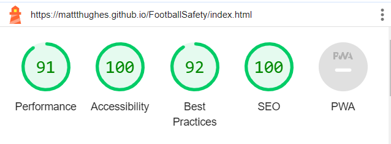

# Football Safety Testing

## CONTENTS
 
- [Football Safety Testing](#football-safety-testing)
  - [CONTENTS](#contents)
  - [Testing Content](#testing-content)
    - [HTML Validation](#html-validation)
      - [Index Validation](#index-validation)
      - [History Validation](#history-validation)
      - [Gallery Validation](#gallery-validation)
      - [Contact us Validation](#contact-us-validation)
      - [Thank you Validation](#thank-you-validation)
      - [Error 404 Validation](#error-404-validation)
    - [CSS Validation](#css-validation)
    - [Solved Bugs](#solved-bugs)
    - [Known bugs](#known-bugs)
    - [Lighthouse testing](#lighthouse-testing)
      - [Mobile After optimisation](#mobile-after-optimisation)
      - [Index](#index)
      - [History](#history)
      - [Gallery](#gallery)
      - [Contact us](#contact-us)
      - [Thank you](#thank-you)
      - [Error 404](#error-404)
      - [Desktop After Optimisation](#desktop-after-optimisation)
      - [Home](#home)
      - [History](#history-1)
      - [Gallery](#gallery-1)
      - [Contact-Page](#contact-page)
      - [Thank you page](#thank-you-page)
      - [Error 404 page](#error-404-page)
    - [Wave report](#wave-report)
      - [Index](#index-1)
      - [History](#history-2)
      - [Gallery](#gallery-2)
      - [Contact us](#contact-us-1)
      - [Thank you](#thank-you-1)
      - [Error 404](#error-404-1)
    - [Manual Testing](#manual-testing)
      - [Aims](#aims)
      - [Testing steps](#testing-steps)
    - [Testing Results](#testing-results)
    - [Elements Testing](#elements-testing)

## Testing Content

### HTML Validation

#### Index Validation

#### History Validation

#### Gallery Validation

#### Contact us Validation

#### Thank you Validation

#### Error 404 Validation

### CSS Validation

- I have completed all the necessary checks making sure all the css code written has no errors and follows best practices.

### Solved Bugs

- Had an issue where the navigation bar wasnt being centered on desktop devices, I changed the padding left value to 6px to fix this issue.
- Fixed a bug where the about us and football safety section were not stacking appropriately on tablet screen sizes.
- Fixed a bug where the contact page was not displaying webpage elements correctly, such as footer titles all being in the wrong pace, to fix this I adjusted the html to improve the formating.
- Fixed a bug where the timeline wasn't stacking correctly, I adjusted the height of the timeline dimensions to fit the issue.
- Another Issue occured where the timeline content was not showing correctly, I deleted the height property in the timeline class to fix the issue and increased the padding top value to seperate the containers correctly.
- Fixed formatting issue for timeline, I ran into an issue where the timeline wasnt adjusting because of the screen size, to fix this I changed the formatting for the mobile device using flex box to make it easier to style the timeline for larger screen sizes.
- Fixed formatting for timeline on laptops and larger devices, to fix this I changed the properties of the timeline container, for the circles and for the vertical timeline bar.
- Fixed the video pathway issue by adding in a dot before the forward slash to correctly show the video element on git hub.
- Fixed an issue where the hover element was showing twice and was much bigger than the social media icon, to fix this I changed the width and height to fit the content.
- Fixed an issue where the nav bar wasnt displaying correctly, the contact us part of the nav bar was going onto the next line, to fix this I changed the padding left value to 0
- Fixed a CSS error that stated top could not be just 100 added the unit to 0 to fix this issue.
- Fixed an issue with contact page where the sign up form radio buttons were not even, to fix this I added different divs for the radio buttons to fix the spacing between the elements.
- Fixed error message for form changed the method from POST to GET to fix this.
- Fixed issue regarding hover effect, the effect would be visible after clicking on mobile, changing this to a media query to only show up when hovered on laptops and desktops fixed this issue.
- Fixed an error with 404 page, the git hub page was continuing to be shown, to fix this I renamed the file to a 404.html and this fixed the issue.
- Fixed styling errors regarding 404 page, the social icons weren't sticking to the bottom of the page increased margin and padding value to fix this.
- Fixed timeline error the timeline on tablets, mobiles and desktop devices was working, but when checking the responsiveness of the website the circles on the timeline were not staying consistent, The issue for this was the large padding left values with different media querys, in order to fix this I adjusted these values and aligned the timeline containers to the center to make sure they were consistent and responsive, to fix the circles I increased the left property to 97% and this fixed how the circles were aligned on the timeline for larger devices such as tablets and larger desktops. I also changed the width for both left and right containers for tablets to 50% and to 100% for the desktop devices.
- Fixed issue regarding contact page, thank you page, error page by adding a padding-top value for social media icons, making sure the layout was staying consistent and was responsive on multiple screen sizes.
- Fixed button error by changing element to an anchor tag and removing the type attribute in order to follow better practices.
  
- Fixed gap between images by adding line height of 0%.
- Fixed issue with gallery on tablet sizes by changing column count to 2 on tablet screen sizes and 3 for larger screen sizes.
- Fixed issue with contact page not displaying correctly added margin-top value to fix issue.
- Fixed empty label error by adding in another span class for the label element for text.
- Fixed error messages on error page the html was deleted and missing went back and inserted html to fix issue.
- Fixed issue with vertical timeline bar, when changing the screen sizes checking the responsiveness the vertical bar would not be consistent and would rise above the circles on the timeline, in order to fix this issue I changed the margin top value from a percentage to pixels which fixed this issue, kept the design consistent across all screen sizes.
- Fixed issue with thank you page on mobile Iphone 12 devices, there was alot of extra space on the web page I added extra padding values to fix this.
- Fixed error page display on mobile Iphone 12 devices by adding extra padding and margin to remove extra space below social media icons.

### Known bugs

- Timeline circles appear to move on the timeline slightly, where some can appear slightly out of place on the timeline after changing many values a fix has not yet been found.

### Lighthouse testing

#### Mobile After optimisation

- This showcases each page, after optimisation showing the home, history and contact page for Mobile versions

#### Index

#### History

#### Gallery

#### Contact us

#### Thank you

#### Error 404

#### Desktop After Optimisation

- This showcases each page, after optimisation showing the home, history and contact page for desktop versions.

#### Home

#### History

#### Gallery

#### Contact-Page

#### Thank you page

#### Error 404 page

### Wave report

#### Index

#### History

#### Gallery

#### Contact us

#### Thank you

#### Error 404

### Manual Testing

#### Aims

- The aim is to make sure the website is responsive for all screen sizes, without needing to rotate the screen.
- Making sure all elements are consistent and not overlapping.
- Each page and device size has the same style making sure font is consistent and isn't different from page to page.
- All videos links and buttons work as intended.
- Make sure error page is deployed by github rather than githubs own error page.
- When submitting the form the form submission takes the user to a thank you page keeping the same design as the rest of the website.

#### Testing steps

- I will test the responsiveness for all screen sizes by firstly right clicking on the website and using the inspect tool, which will open the google chrome deveopler tools.
- Following this I will click on the laptop in the developer tools and change the aspect ratio to 280px which is the lowest screen size, After this I will begin adjusting the screen size for all pages making sure all elements are displaying correctly on all screen sizes.
- I will be testing all elements such as links making sure they open in new tabs for social media icons and video links, buttons making sure they return to the right pages and there is no errors.
- I will be making sure the video doesn't autoplay and is muted to start with to follow best practices.
- I will make sure github will be finding the error page I created for the website compared to the usual github error page that is usually displayed.
- Doing the above steps will make sure each element is responsive and is working as intended.
- All elements will be tested using Internet explorer, Google Chrome and Firefox.

### Testing Results

|   **Responsiveness**   | **Index** | **About** | **Gallery** | **Contact us** | **Thank you** | **Error 404** |
| :--------------------: | :-------: | :-------: | :---------: | :------------: | :-----------: | :-----------: |
|        Nav bar         |   Pass    |   Pass    |    Pass     |      Pass      |     Pass      |     Pass      |
|    Background image    |   Pass    |    N/A    |     N/A     |      N/A       |      N/A      |      N/A      |
|       Cover text       |   Pass    |    N/A    |     N/A     |      N/A       |      N/A      |      N/A      |
|        About us        |   Pass    |    N/A    |     N/A     |      N/A       |      N/A      |      N/A      |
| History nearly section |   Pass    |    N/A    |     N/A     |      N/A       |      N/A      |      N/A      |
|  History nearly video  |   Pass    |    N/A    |     N/A     |      N/A       |      N/A      |      N/A      |
|  History nearly link   |   Pass    |    N/A    |     N/A     |      N/A       |      N/A      |      N/A      |
|      History text      |    N/A    |   Pass    |     N/A     |      N/A       |      N/A      |      N/A      |
|    History timeline    |    N/A    |   Pass    |     N/A     |      N/A       |      N/A      |      N/A      |
|     Future updates     |    N/A    |   Pass    |     N/A     |      N/A       |      N/A      |      N/A      |
|      Contact form      |    N/A    |    N/A    |     N/A     |      Pass      |      N/A      |      N/A      |
|        Gallery         |    N/A    |    N/A    |    Pass     |      N/A       |      N/A      |      N/A      |
|  Contact form button   |    N/A    |    N/A    |     N/A     |      Pass      |      N/A      |      N/A      |
|         Footer         |   Pass    |   Pass    |    Pass     |      Pass      |     Pass      |     Pass      |
|   Social media icons   |   Pass    |   Pass    |    Pass     |      Pass      |     Pass      |     Pass      |

### Elements Testing

`Home Page`

|         **Element**          |                          **Expected outcome**                          |    **Testing Performed**     |                **Result**                | **Pass/Fail** |
| :--------------------------: | :--------------------------------------------------------------------: | :--------------------------: | :--------------------------------------: | :-----------: |
|          Site title          |                    Link directly back to home page                     |      Clicked Home title      |             Home page loaded             |     Pass      |
|     Navigation bar icon      |         when icon clicked display page names underneath title          |       clicked nav icon       |            page names appear             |     Pass      |
|    Navigation bar (Home)     |             When Home page clicked direct to Home clicked              |      Clicked Home page       |             Home page loaded             |     Pass      |
|   Navigation bar (History)   |            When History page clicked direct to History page            |     Clicked History page     |           History page loaded            |     Pass      |
|   Navigation bar (Gallery)   |            When Gallery Page clicked direct to Gallery page            |     Clicked Gallery page     |           Gallery page loaded            |     Pass      |
| Navigation bar (Contact us)  |            When Contact page clicked direct to contact page            |     Clicked Contact page     |           Contact page loaded            |     Pass      |
| Navigation bar(Hover effect) |     When pages hovered over white border to appear over page names     |      Hovered over pages      |           White border appears           |     Pass      |
|            Video             | Video not to autoplay and to give the user complete control over video | Loaded page and clicked play | Video did not autoplay, user had control |     Pass      |
|          Video link          |                        Link to open in new tab                         |      Clicked Video link      |          Link opened in new tab          |     Pass      |
|  Video link (Hover effect)   |               Link to have red border when hovered over                |      Hovered over link       |           Red border appeared            |     Pass      |
|      Social Media icons      |                        Icon to open in new tab                         |        Clicked icons         |            Opened in new tab             |     Pass      |
| Social Media (Hover effect)  |           White circular border to appear when hovered over            |      Hovered over icon       |        Hover and styles appeared         |     Pass      |

`History`

|         **Element**          |                      **Expected outcome**                      | **Testing performed** |        **Result**         | **Pass/Fail** |
| :--------------------------: | :------------------------------------------------------------: | :-------------------: | :-----------------------: | :-----------: |
|          Site title          |                Link directly back to home page                 |  Clicked Home title   |     Home page loaded      |     Pass      |
|     Navigation bar icon      |     when icon clicked display page names underneath title      |   clicked nav icon    |     page names appear     |     Pass      |
|    Navigation bar (Home)     |         When Home page clicked direct to Home clicked          |   Clicked Home page   |     Home page loaded      |     Pass      |
|   Navigation bar (History)   |        When History page clicked direct to History page        | Clicked History page  |    History page loaded    |     Pass      |
|   Navigation bar (Gallery)   |        When Gallery Page clicked direct to Gallery page        | Clicked Gallery page  |    Gallery page loaded    |     Pass      |
| Navigation bar (Contact us)  |        When Contact page clicked direct to contact page        | Clicked Contact page  |    Contact page loaded    |     Pass      |
| Navigation bar(Hover effect) | When pages hovered over white border to appear over page names |  Hovered over pages   |   White border appears    |     Pass      |
|      Social Media icons      |                    Icon to open in new tab                     |     Clicked icons     |     Opened in new tab     |     Pass      |
| Social Media (Hover effect)  |       White circular border to appear when hovered over        |   Hovered over icon   | Hover and styles appeared |     Pass      |

`Gallery page`

|         **Element**          |                      **Expected outcome**                      | **History page loaded** |        **Result**         | **Pass/Fail** |
| :--------------------------: | :------------------------------------------------------------: | :---------------------: | :-----------------------: | :-----------: |
|          Site title          |                Link directly back to home page                 |   Clicked Home title    |     Home page loaded      |     Pass      |
|     Navigation bar icon      |     when icon clicked display page names underneath title      |    clicked nav icon     |     page names appear     |     Pass      |
|    Navigation bar (Home)     |         When Home page clicked direct to Home clicked          |    Clicked Home page    |     Home page loaded      |     Pass      |
|   Navigation bar (History)   |        When History page clicked direct to History page        |  Clicked History page   |    History page loaded    |     Pass      |
|   Navigation bar (Gallery)   |        When Gallery Page clicked direct to Gallery page        |  Clicked Gallery page   |    Gallery page loaded    |     Pass      |
| Navigation bar (Contact us)  |        When Contact page clicked direct to contact page        |  Clicked Contact page   |    Contact page loaded    |     Pass      |
| Navigation bar(Hover effect) | When pages hovered over white border to appear over page names |   Hovered over pages    |   White border appears    |     Pass      |
|      Social Media icons      |                    Icon to open in new tab                     |      Clicked icons      |     Opened in new tab     |     Pass      |
| Social Media (Hover effect)  |       White circular border to appear when hovered over        |    Hovered over icon    | Hover and styles appeared |     Pass      |

`Contact us page`

|         **Element**          |                             **Expected outcome**                              |           **Testing performed**            |                              **Result**                               | **Pass/Fail** |
| :--------------------------: | :---------------------------------------------------------------------------: | :----------------------------------------: | :-------------------------------------------------------------------: | :-----------: |
|          Site title          |                        Link directly back to home page                        |             Clicked Home title             |                           Home page loaded                            |     Pass      |
|     Navigation bar icon      |             when icon clicked display page names underneath title             |              clicked Nav icon              |                           page names appear                           |     Pass      |
|    Navigation bar (Home)     |                 When Home page clicked direct to Home clicked                 |             Clicked Home page              |                           Home page loaded                            |     Pass      |
|   Navigation bar (History)   |               When History page clicked direct to History page                |            Clicked History page            |                          History page loaded                          |     Pass      |
|   Navigation bar (Gallery)   |               When Gallery Page clicked direct to Gallery page                |            Clicked Gallery page            |                          Gallery page loaded                          |     Pass      |
| Navigation bar (Contact us)  |               When Contact page clicked direct to contact page                |            Clicked Contact page            |                          Contact page loaded                          |     Pass      |
| Navigation bar(Hover effect) |        When pages hovered over white border to appear over page names         |             Hovered over pages             |                         White border appears                          |     Pass      |
|      Social Media icons      |                            Icon to open in new tab                            |               Clicked icons                |                           Opened in new tab                           |     Pass      |
| Social Media (Hover effect)  |               White circular border to appear when hovered over               |             Hovered over icon              |                       Hover and styles appeared                       |     Pass      |
|   Contact page text input    |                        Allow the user to type in text                         |       Clicked text box, began typing       |                       Text appeared in text box                       |     Pass      |
|     Text input required      |   When submitting form without filling in this will be flagged as required    | submitted form without filling in text box |                      Flagged textbox as required                      |     Pass      |
|         Email Input          |   When submitting the form email must be filled in and requires an @ symbol   | submitted form without filling in text box |                       Flagged email as required                       |     Pass      |
| Emain Input without @ symbol |     Form requires email to have an @ symbol form to flag this as required     |      submitted form without @ symbol       |            Flagged email as required and needing @ symbol             |     Pass      |
|  Email Input with @ symbol   |         Email not to be flagged if containing @ symbol and filled in          |       filled in input with @ symbol        |                    Form was submitted succesfully                     |     Pass      |
|  Radio buttons not selected  |                    Radio buttons to be flagged as required                    |         Radio button not selected          |                 Radio buttons was flagged as required                 |     Pass      |
|    Radio buttons selected    |                         Radio buttons to be selected                          |           Radio button selected            |           Radio button was selected and form was submitted            |     Pass      |
|        Submit button         | button to submit form, load thank you page if all required elements completed |           Submit button clicked            | Form submitted, thank you page loaded all required elements completed |     Pass      |
| Submit button(Hover effect)  |                         button to change color to red                         |            Button hovered over             |             button style changed to red when hovered over             |     Pass      |

`Thank you page`

|         **Element**          |                      **Expected outcome**                      | **Testing performed** |                  **Result**                   | **Pass/Fail** |
| :--------------------------: | :------------------------------------------------------------: | :-------------------: | :-------------------------------------------: | :-----------: |
|          Site title          |                Link directly back to home page                 |  Clicked Home title   |               Home page loaded                |     Pass      |
|     Navigation bar icon      |     when icon clicked display page names underneath title      |   clicked nav icon    |               page names appear               |     Pass      |
|    Navigation bar (Home)     |         When Home page clicked direct to Home clicked          |   Clicked Home page   |               Home page loaded                |     Pass      |
|   Navigation bar (History)   |        When History page clicked direct to History page        | Clicked History page  |              History page loaded              |     Pass      |
|   Navigation bar (Gallery)   |        When Gallery Page clicked direct to Gallery page        | Clicked Gallery page  |              Gallery page loaded              |     Pass      |
| Navigation bar (Contact us)  |        When Contact page clicked direct to contact page        | Clicked Contact page  |              Contact page loaded              |     Pass      |
| Navigation bar(Hover effect) | When pages hovered over white border to appear over page names |  Hovered over pages   |             White border appears              |     Pass      |
|      Social Media icons      |                    Icon to open in new tab                     |     Clicked icons     |               Opened in new tab               |     Pass      |
| Social Media (Hover effect)  |       White circular border to appear when hovered over        |   Hovered over icon   |           Hover and styles appeared           |     Pass      |
|  Back button(Hover effect)   |                 button to change color to red                  |  Button hovered over  | button style changed to red when hovered over |     Pass      |

`Error 404 page`

|         **Element**          |                      **Expected outcome**                      | **Testing performed** |                  **Result**                   | **Pass/Fail** |
| :--------------------------: | :------------------------------------------------------------: | :-------------------: | :-------------------------------------------: | :-----------: |
|          Site title          |                Link directly back to home page                 |  Clicked Home title   |               Home page loaded                |     Pass      |
|     Navigation bar icon      |     when icon clicked display page names underneath title      |   clicked nav icon    |               page names appear               |     Pass      |
|    Navigation bar (Home)     |         When Home page clicked direct to Home clicked          |   Clicked Home page   |               Home page loaded                |     Pass      |
|   Navigation bar (History)   |        When History page clicked direct to History page        | Clicked History page  |              History page loaded              |     Pass      |
|   Navigation bar (Gallery)   |        When Gallery Page clicked direct to Gallery page        | Clicked Gallery page  |              Gallery page loaded              |     Pass      |
| Navigation bar (Contact us)  |        When Contact page clicked direct to contact page        | Clicked Contact page  |              Contact page loaded              |     Pass      |
| Navigation bar(Hover effect) | When pages hovered over white border to appear over page names |  Hovered over pages   |             White border appears              |     Pass      |
|      Social Media icons      |                    Icon to open in new tab                     |     Clicked icons     |               Opened in new tab               |     Pass      |
| Social Media (Hover effect)  |       White circular border to appear when hovered over        |   Hovered over icon   |           Hover and styles appeared           |     Pass      |
|  Back button(Hover effect)   |                 button to change color to red                  |  Button hovered over  | button style changed to red when hovered over |     Pass      |
